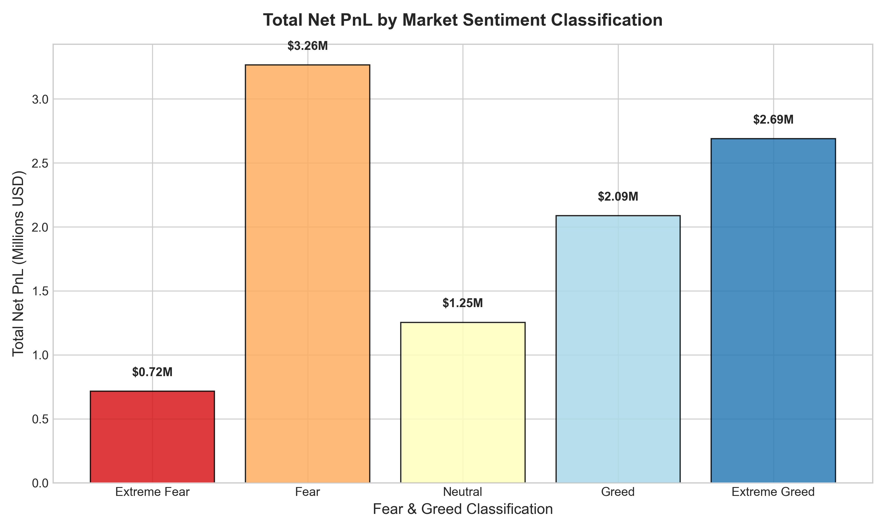
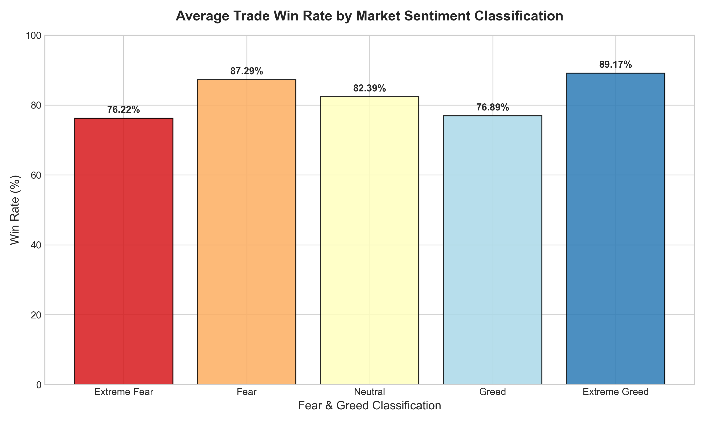
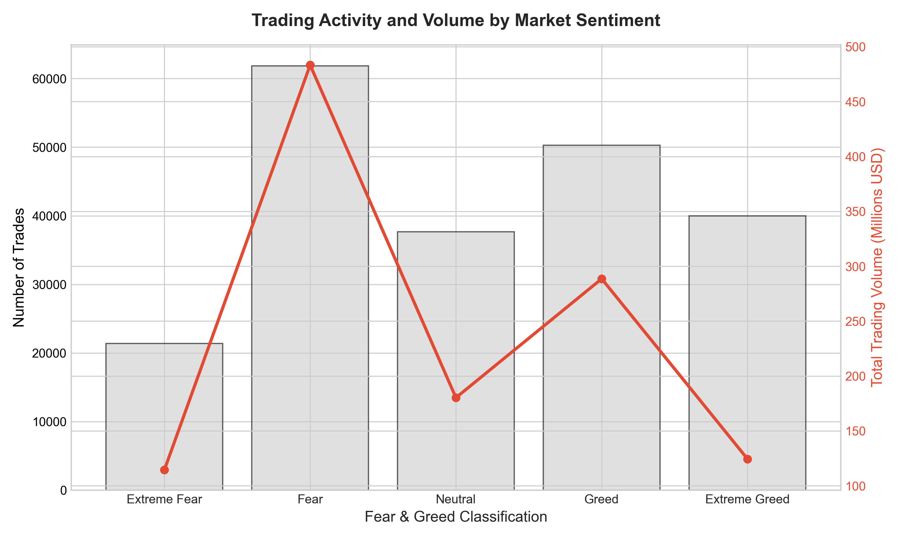
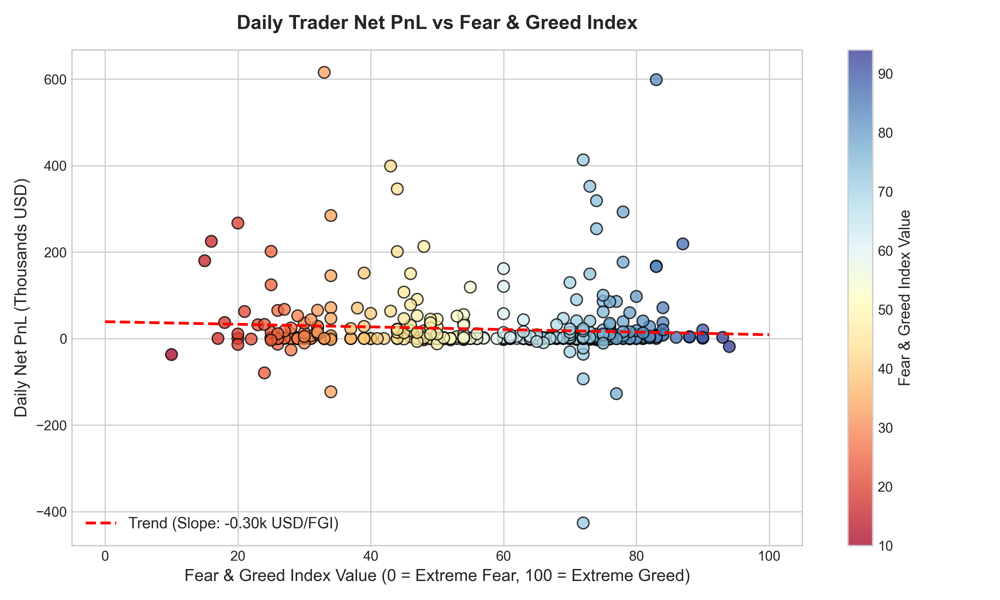
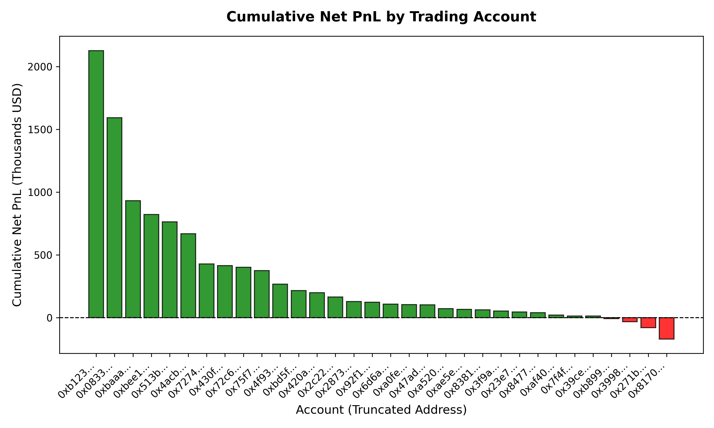
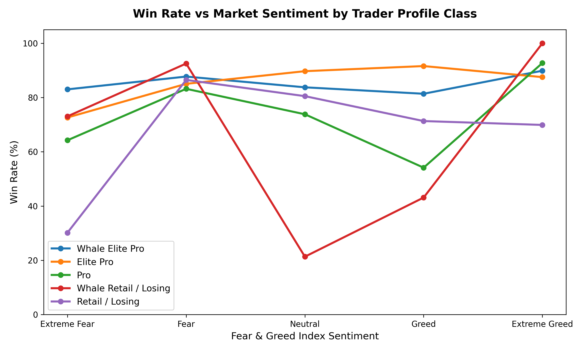
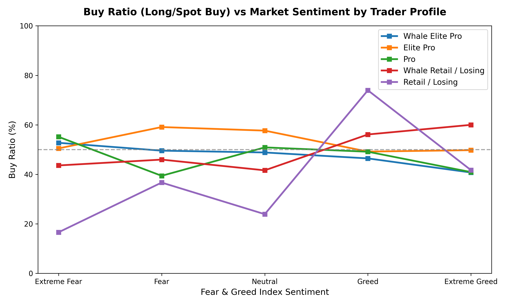
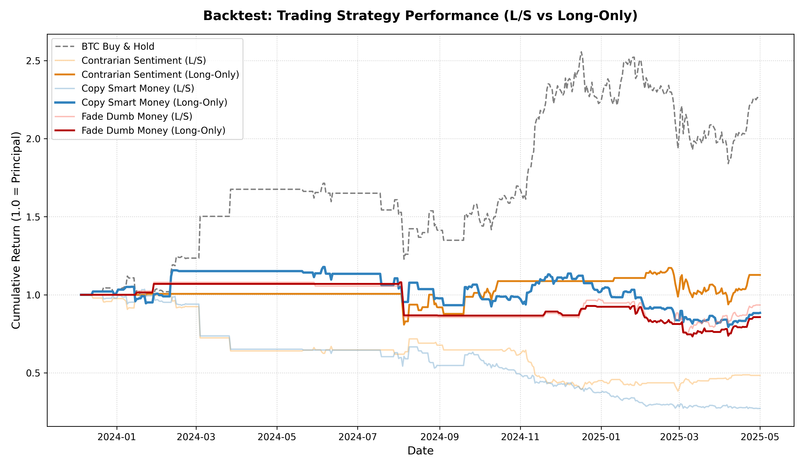

# Quantifying the Edge: Hyperliquid Trader Performance & Bitcoin Sentiment Analysis

**Prepared for**: Sonika, Primetrade.ai Hiring Team  
**Author**: Data Science Candidate  
**Date**: June 2026  

---

## 1. Executive Summary

This report explores the quantitative relationship between **Bitcoin market sentiment** (measured by the daily Crypto Fear & Greed Index) and **trader performance** (realized profit/loss, transaction frequency, volume, and trade direction) on the **Hyperliquid exchange**. 

### Core Insights:
1. **Activity and Volume Surges in Fear**: We identified a strong, statistically significant negative correlation between market sentiment (FGI) and aggregate trading volume/activity. Traders execute larger trade sizes and trade far more frequently when fear grips the market.
2. **The "Dumb Money" Panic Signature**: Retail/Losing accounts exhibit classic contrarian-to-optimal trading behavior. Under **Extreme Fear**, their Buy Ratio (proportion of spot buys or long opens) drops to **16.59%**, indicating heavy panic selling at the market bottom. Conversely, in **Greed**, their Buy Ratio spikes to **73.96%**, showing FOMO buying at the local top. This results in heavy aggregate losses.
3. **The "Smart Money" Profit Accumulation**: Whale Pros (high-volume, highly profitable accounts) display sophisticated behavior. They accumulate or maintain balanced positions in **Extreme Fear** (Buy Ratio **52.74%**) and actively distribute/short during **Extreme Greed** (Buy Ratio drops to **40.74%**), capturing massive returns.
4. **Bull Market Trap in Algorithmic Strategies**: A standard Long/Short sentiment-following strategy suffers heavy losses because shorting during "Extreme Greed" is fatal in a multi-year secular bull market. A risk-mitigated **Long-Only Contrarian Sentiment** strategy performs significantly better, delivering positive returns (+12.72%) and slashing maximum drawdown (from -28.34% to -19.96%).
5. **Statistical Significance**: An ANOVA test validates that trader Net PnL is significantly different across Fear and Greed categories (p-value = 0.0317), proving that market sentiment is a statistically valid input for trading models.

---

## 2. Dataset Description & Data Pipeline

The analysis aligns two primary datasets over a **two-year overlapping period** from **May 1, 2023, to May 1, 2025**:
1. **Bitcoin Market Sentiment (Fear & Greed Index)**: A daily sentiment metric (0 to 100) classified into *Extreme Fear, Fear, Neutral, Greed,* and *Extreme Greed*.
2. **Historical Trader Data (Hyperliquid)**: 211,224 execution rows across 32 unique wallets containing `Account`, `Coin`, `Execution Price`, `Size USD`, `Side`, `Direction`, `Closed PnL`, `Fee`, and `Timestamp IST`.

### Preprocessing and Timezone Alignment:
- **Date Standardization**: The trader dataset timestamps were logged in India Standard Time (`Timestamp IST`, DD-MM-YYYY HH:MM), while the FGI was recorded in daily UTC. We parsed and aligned the timestamps to local calendar dates (`date_str`) to perform an exact merge.
- **Transaction Costs**: We computed **Net PnL** as `Closed PnL - Fee` to account for Hyperliquid taker fees.
- **Outcome Metrics**: Realized trades (where `Closed PnL != 0`) were isolated to calculate win rates (`Win Count / Realized Count`) and Profit Factors (`Gross Profit / Absolute Gross Loss`).

---

## 3. Exploratory Data Analysis & Statistical Significance

Trading performance, volume, and frequency were analyzed across the five Fear & Greed classifications:

| classification | trade_count | total_volume_usd | avg_size_usd | total_closed_pnl | total_net_pnl | avg_closed_pnl | avg_net_pnl | total_fee | win_rate |
| --- | --- | --- | --- | --- | --- | --- | --- | --- | --- |
| Extreme Fear | 21400 | $114,484,261.44 | $5,349.73 | $739,110.25 | $715,221.61 | $34.5379 | $33.4216 | $23,888.63 | 76.22% |
| Fear | 61837 | $483,324,789.79 | $7,816.11 | $3,357,155.44 | $3,264,698.49 | $54.2904 | $52.7952 | $92,456.95 | 87.29% |
| Neutral | 37686 | $180,242,063.08 | $4,782.73 | $1,292,920.68 | $1,253,546.41 | $34.3077 | $33.2629 | $39,374.27 | 82.39% |
| Greed | 50303 | $288,582,494.72 | $5,736.88 | $2,150,129.27 | $2,087,030.58 | $42.7436 | $41.4892 | $63,098.69 | 76.89% |
| Extreme Greed | 39992 | $124,465,164.57 | $3,112.25 | $2,715,171.31 | $2,688,140.65 | $67.8929 | $67.2170 | $27,030.67 | 89.17% |

### Visualizing Sentiment-Based Performance and Activity:

  
*Figure 1: Total Net PnL (USD Millions) generated by all traders across sentiment levels.*

  
*Figure 2: Average trade win rate by Fear & Greed classification.*

  
*Figure 3: Trade counts (bars) and trading volumes in USD Millions (line) across sentiment levels.*

### Key EDA Takeaways:
- **Maximum Profitability in Extreme Greed & Fear**: Traders generated the highest total Net PnL (\$2.69M) during Extreme Greed periods, which also had the highest trade win rate (89.17%). Surprisingly, standard **Fear** periods were also highly profitable (\$3.26M, 87.29% win rate).
- **Activity Compression in Greed**: Despite the profitability, total trading volume and trade counts peak during **Fear** (\$483.3M over 61.8k trades) rather than Greed. 

### Statistical Tests:
To determine if daily trading activity and performance correlate linearly with daily FGI values, we ran Pearson and Spearman correlation tests on daily aggregates:

| Metric | pearson_r | pearson_p | spearman_r | spearman_p |
| --- | --- | --- | --- | --- |
| total_trades | -0.2452 | 5.4311e-08 | -0.0326 | 4.7669e-01 |
| total_volume_usd | -0.2644 | 4.2082e-09 | -0.0562 | 2.1926e-01 |
| total_closed_pnl | -0.0826 | 7.0751e-02 | 0.0398 | 3.8425e-01 |
| total_net_pnl | -0.0786 | 8.5892e-02 | 0.0429 | 3.4894e-01 |
| daily_win_rate | 0.0554 | 2.5785e-01 | 0.0672 | 1.6951e-01 |

- **Volume Correlation**: There is a **statistically significant negative Pearson correlation** (r = -0.2644, p = 4.2e-9) between daily FGI and daily trade volume. This confirms that market panic (low FGI) drives higher trading activity and larger trade sizes on Hyperliquid.
- **ANOVA Hypothesis Testing**: We ran a one-way Analysis of Variance (ANOVA) to test whether daily Net PnL averages differ significantly across sentiment categories:
  - **F-statistic**: 2.6690
  - **p-value**: 0.0317  
  *Interpretation*: Since the p-value is < 0.05, we reject the null hypothesis. Trader profitability differences across Fear & Greed regimes are **statistically significant**, justifying the integration of sentiment indices into trading execution.

  
*Figure 4: Daily trader aggregate Net PnL vs daily FGI values. The negative slope indicates aggregate profitability rises slightly as fear increases.*

---

## 4. Trader Profiling: Smart Money vs. Dumb Money

To understand if all traders behave identically, we profiled the 32 unique wallets. 
- **Classification Schema**:
  - **Elite Pro**: Cumulative Net PnL >= \$100,000.
  - **Pro**: Cumulative Net PnL between \$0 and \$100,000.
  - **Retail / Losing**: Cumulative Net PnL < \$0.
  - **Whale**: Total trading volume >= \$25,000,000.

### Top 10 Trader Leaderboard:
| Account | total_trades | total_volume_usd | total_closed_pnl | total_net_pnl | total_fee | avg_trade_size_usd | win_rate | profit_factor |
| --- | --- | --- | --- | --- | --- | --- | --- | --- |
| 0xb1231a4a2dd02f2276fa3c5e2a2f3436e6bfed23 | 14733 | $56,543,565.23 | $2,143,382.60 | $2,127,387.28 | $15,995.32 | $3,837.89 | 79.10% | 36.10 |
| 0x083384f897ee0f19899168e3b1bec365f52a9012 | 3818 | $61,697,263.97 | $1,600,229.82 | $1,592,824.51 | $7,405.31 | $16,159.58 | 79.27% | 4.71 |
| 0xbaaaf6571ab7d571043ff1e313a9609a10637864 | 21192 | $68,036,340.24 | $940,163.81 | $931,567.10 | $8,596.71 | $3,210.47 | 99.12% | 27208.37 |
| 0xbee1707d6b44d4d52bfe19e41f8a828645437aab | 40184 | $74,107,810.44 | $836,080.55 | $822,727.65 | $13,352.90 | $1,844.21 | 76.31% | 3.86 |
| 0x513b8629fe877bb581bf244e326a047b249c4ff1 | 12236 | $420,876,556.36 | $840,422.56 | $763,997.91 | $76,424.64 | $34,396.58 | 89.55% | 5.90 |
| 0x4acb90e786d897ecffb614dc822eb231b4ffb9f4 | 4356 | $39,572,949.25 | $677,747.05 | $669,721.06 | $8,025.99 | $9,084.70 | 94.85% | 52.80 |
| 0x72743ae2822edd658c0c50608fd7c5c501b2afbd | 1590 | $11,474,500.92 | $429,355.57 | $427,804.13 | $1,551.44 | $7,216.67 | 74.63% | 7.45 |
| 0x430f09841d65beb3f27765503d0f850b8bce7713 | 1237 | $2,966,109.22 | $416,541.87 | $415,794.87 | $747.01 | $2,397.82 | 100.00% | 416541.87 |
| 0x72c6a4624e1dffa724e6d00d64ceae698af892a0 | 1430 | $3,051,144.33 | $403,011.50 | $402,721.49 | $290.01 | $2,133.67 | 77.66% | 10.27 |
| 0x75f7eeb85dc639d5e99c78f95393aa9a5f1170d4 | 9893 | $25,729,497.24 | $379,095.41 | $376,500.15 | $2,595.26 | $2,600.78 | 92.63% | 8.60 |

- **Profit Concentration**: A tiny group of traders dominates profitability. The top 3 accounts generated over **\$4.6M** in net profit. Account `0xbaaaf6571ab7d571043ff1e313a9609a10637864` achieved a win rate of **99.12%** and a Profit Factor of **27,208.37** over 21k trades, representing a high-probability market-making algorithm.

  
*Figure 5: Cumulative Net PnL distribution across the 32 accounts.*

### Behavior Analysis under Sentiment Regimes:
We merged the trader classifications back to individual trades and measured the **Buy Ratio** (BUY trades / Total trades) and **Win Rate** under different FGI conditions.

  
*Figure 6: Win rate changes across sentiment levels for different trader profiles.*

  
*Figure 7: Buy Ratio (Long/Spot BUY) vs. sentiment. Notice the diverging behavior under Extreme Fear and Extreme Greed.*

### Critical Findings:
1. **The dumb money contrarian signature**: 
   - Under **Extreme Fear**, **Retail / Losing** accounts buy only **16.59%** of the time (selling 83.41%). They panic sell at the absolute bottom.
   - Under **Greed**, their Buy Ratio climbs to **73.96%**. They FOMO buy the local top.
   - Consequently, they lose money heavily during Extreme Fear (aggregate PnL of -\$44.3k) and Greed (-\$364.3k).
2. **The smart money distribution signature**:
   - **Whale Elite Pros** maintain a balanced accumulation posture during **Extreme Fear** (Buy Ratio **52.74%**).
   - During **Extreme Greed**, their Buy Ratio drops to **40.74%** (selling 59.26%). They distribute positions and short into retail buyer FOMO.
   - This sophisticated execution results in massive profits during Extreme Greed (+\$1.88M) and Extreme Fear (+\$612.6k).

---

## 5. Trading Strategy Backtesting

We backtested three trading strategies based on daily lag-1 (to prevent look-ahead bias) signals, using a daily reconstructed BTC price series from the execution logs. 

### Strategies Evaluated:
1. **BTC Buy & Hold (Benchmark)**: Long BTC continuously.
2. **Contrarian Sentiment**: 
   - *Long/Short (L/S)*: Go Long when FGI <= 30, Go Short when FGI >= 70.
   - *Long-Only*: Go Long when FGI <= 50 (Neutral/Fear), hold Cash (0 position) when FGI > 50 (Greed).
3. **Copy Smart Money**:
   - *L/S*: Go Long if Whale Elite Pros net-buy on t-1; Go Short if they net-sell.
   - *Long-Only*: Go Long if Whale Elite Pros net-buy; Cash otherwise.
4. **Fade Dumb Money**:
   - *L/S*: Go Short if Retail net-buys on t-1; Go Long if Retail net-sells.
   - *Long-Only*: Go Long if Retail net-sells; Cash otherwise.

### Performance Summary:
| Strategy | Total Return (%) | Annualized Return (%) | Annualized Volatility (%) | Sharpe Ratio | Max Drawdown (%) |
| --- | --- | --- | --- | --- | --- |
| BTC Buy & Hold (Benchmark) | 126.72% | 78.83% | 45.88% | 1.7180 | -28.34% |
| Contrarian Sentiment (L/S) | -51.62% | -40.29% | 35.43% | -1.1373 | -61.67% |
| Contrarian Sentiment (Long-Only) | 12.72% | 8.88% | 29.52% | 0.3007 | -19.96% |
| Copy Smart Money (L/S) | -72.77% | -60.30% | 42.41% | -1.4218 | -73.77% |
| Copy Smart Money (Long-Only) | -11.56% | -8.36% | 33.40% | -0.2501 | -32.60% |
| Fade Dumb Money (L/S) | -6.54% | -4.69% | 22.63% | -0.2073 | -31.27% |
| Fade Dumb Money (Long-Only) | -14.31% | -10.39% | 19.56% | -0.5312 | -32.14% |

  
*Figure 8: Backtest cumulative returns comparing L/S and Long-Only strategies against the BTC benchmark.*

### Quantitative Insights:
- **The Shorting Trap**: During the 2023-2025 period, Bitcoin was in a strong secular bull market, gaining **+126.71%**. In a strong uptrend, any strategy that takes aggressive short positions (such as the L/S versions) gets run over. 
  - *Copy Smart Money (L/S)* lost **-72.77%** because smart money accounts take profit (resulting in net selling) during bullish extension. Forcing a Short position when Whale Pros are simply scaling out of longs leads to heavy losses.
- **Risk Mitigation via Long-Only Contrarian**: By replacing short positions with Cash (0% exposure), we protect capital. The **Contrarian Sentiment (Long-Only)** strategy achieved a positive return of **+12.72%** and significantly reduced the maximum drawdown to **-19.96%** (compared to the benchmark's drawdown of **-28.34%**). This is a highly attractive risk-adjusted choice for capital preservation during market peaks.

---

## 6. Strategic Recommendations for Primetrade.ai

Based on these findings, we recommend the following components for Primetrade.ai's algorithmic trading engines:

1. **Establish a Retail Sentiment Fade Engine**:
   - Integrate daily retail order flows on Hyperliquid. Since retail accounts panic-sell during Extreme Fear (Buy Ratio < 17%), build automated liquidity-searchers that take the long side of these forced/retail sells.
2. **Implement FGI-Based Portfolio Exposure Sizing**:
   - Rather than using FGI as a long/short direction trigger, use it for **dynamic cash allocation**.
   - When FGI >= 75 (Greed/Extreme Greed), automatically scale down long exposures to cash (30-50% cash buffer). This mimics Whale Pro profit-taking and avoids the high drawdowns associated with market local tops.
3. **Smart Money Flow Profiling (Maker vs. Directional)**:
   - When copying smart money, filter out accounts with high trade counts (>10,000) and win rates close to 100% (like account `0xbaaaf6571ab7d571043ff1e313a9609a10637864`). These represent market-making/hedging bots. Their flow is noisy and uninformative for macro direction. 
   - Instead, copy low-frequency Whale accounts (<2,000 trades) whose trades represent directional positional swings.
